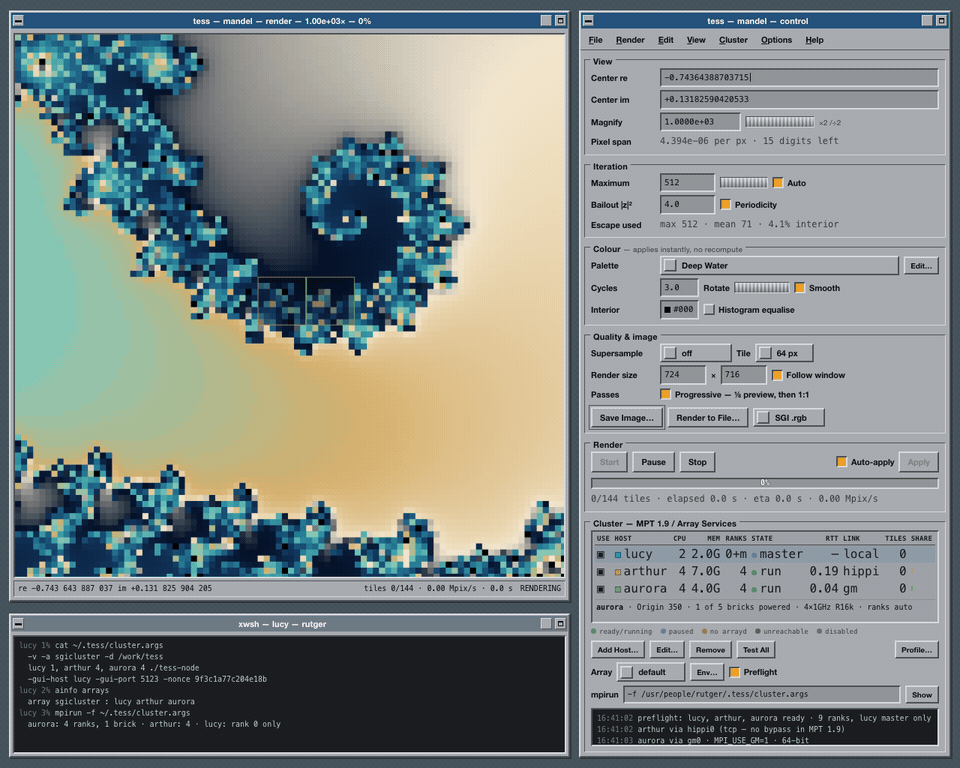

# Tess

A distributed render framework for **real Silicon Graphics hardware** — IRIX 6.5.30,
MIPSpro 7.4.4, SGI MPT 1.9 (MPI 4.4), Motif 2.1.20 with libSgm.



*The design, in motion: 144 tiles dealt centre-out across arthur and aurora while lucy
shades and blits. Not a screenshot of working software — this is the UI design, rendered
from the same markup and fractal maths the real thing will use.*

The first module is a Mandelbrot renderer, reviving a set of 2001-era sources. The point
isn't the fractal — it's the framework underneath: a tile scheduler, a credit-based
prefetch pipeline, and a two-window Motif UI, all running across a small heterogeneous
MIPS cluster over MPI.

**Status: design complete, nothing built.** `doc/DESIGN.md` is the contract.

## The cluster

| Host | Machine | CPUs | Role |
|---|---|---|---|
| `lucy` | Octane2, VPro V12 | 2 × R14000 600 MHz | GUI, master rank, PCP collector — no compute |
| `arthur` | Onyx2, IR2/IE2 pipe | 4 × R12000 400 MHz | 4 compute ranks |
| `aurora` | Origin 350, NUMAlink | 4 or 20 × R16000 | compute ranks = whatever is powered on |

Aurora runs one brick day to day and all five when it's worth the electricity. Both are
valid shapes of the same host, and the software resolves rank counts at preflight rather
than caring which.

## Layout

```
doc/DESIGN.md            the engineering contract — decisions, scheduling, wire format
doc/PLATFORM-FACTS.md    every platform claim, each citing the install medium it came from
doc/CHECKLIST.md         linear bring-up runbook; steps 1-5 are the critical path
doc/BRINGUP.md           long-form bring-up, plus recorded hardware state
doc/GM-MPT-INTEROP.md    whether Myrinet GM 1.6.4 can drive MPT — yes, bar one symbol
doc/HARDWARE-CHECKS.md   a 20-minute verification pass at the machines
design/ui-design.html    the approved two-window mockup
baseline/                the 2001 originals this replaces
tools/                   pingpong benchmark, a GM symbol shim, a macOS syntax gate
```

## Design constraints worth knowing up front

- **One interconnect per MPI job.** MPT selects XPMEM → GSN → MYRINET → TCP for the whole
  job, not per host pair. HIPPI to arthur and Myrinet to aurora cannot coexist in one
  `mpirun`. This single fact shapes the architecture.
- **No multi-host `MPI_Comm_spawn` on IRIX**, so the rank set is fixed when `mpirun` starts
  and the GUI has to be a separate long-lived process.
- **C89 only.** MIPSpro 7.4.4 is not a C99 compiler.
- **3 bytes per pixel on the wire** — a `u16` iteration count plus a `u8` smooth fraction.
  Same cost as RGB8, and it keeps palette changes instant via a lookup table.

## The MPT reference material

`doc/mpt/` holds headers, man pages and release notes extracted from *IRIX 6.5
Applications* — the authority behind every MPI claim in the docs. They carry SGI's
proprietary notice, which is why **this repository is private**. Do not make it public
without first excluding that directory; `doc/instx.py` regenerates it from the install
media for anyone who owns a copy:

```sh
python3 doc/instx.py /path/to/dist/mpt   # SGI inst image extractor
```
